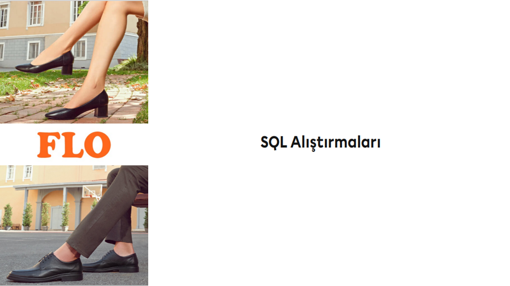

# FLO-Customer-Shopping-Analysis-SQL-Case-Study

 

## Business Problem

FLO Retailing, an online shoe store, wants to divide its customers into segments and determine **marketing strategies** according to these segments. To this end, customers' behaviors will be defined and groups will be created based on clusters in these behaviors.

## Dataset Story

The dataset consists of historical shopping behaviors of customers who made purchases both **online** and **offline** from FLO between 2020 and 2021, obtained from past shopping data.

## Features of Dataset

- **Total Features :** 13
- **Total Row :** 19.945
- **CSV File Size :** 2.7 MB

## Variable Descriptions

**master_id:** Unique customer number

**order_channel:** Which channel of the shopping platform used (Android, iOS, desktop, mobile)

**last_order_channel:** Channel where the last shopping was made

**first_order_date:** Customer's first shopping date

**last_order_date:** Customer's latest shopping date

**last_order_date_online:** Customer's latest shopping date on the online platform

**last_order_date_offline:** Customer's latest shopping date on offline platform

**order_num_total_ever_online:** Customer's total number of shopping on the online platform

**order_num_total_ever_offline:** Customer's total number of shopping on the offline platform

**customer_value_total_ever_offline:** Total fee paid by the customer in offline shopping

**customer_value_total_ever_online:** Total fee paid by the customer in online shopping

**interested_in_categories_12:** List of categories where the customer shopping in the last 12 months

**store_type:** It represents 3 different companies. If a person who made a purchase from company A also made a purchase from company B, it is written as A,B.
